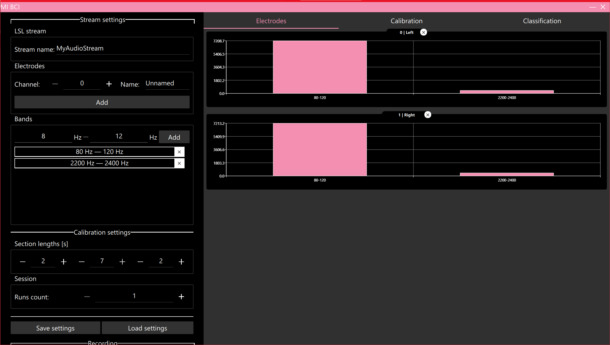
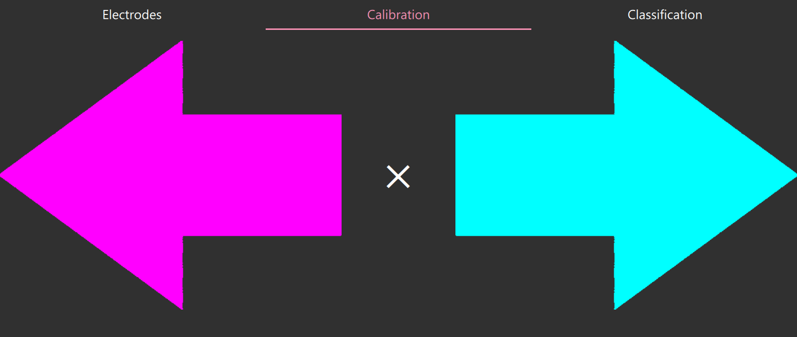
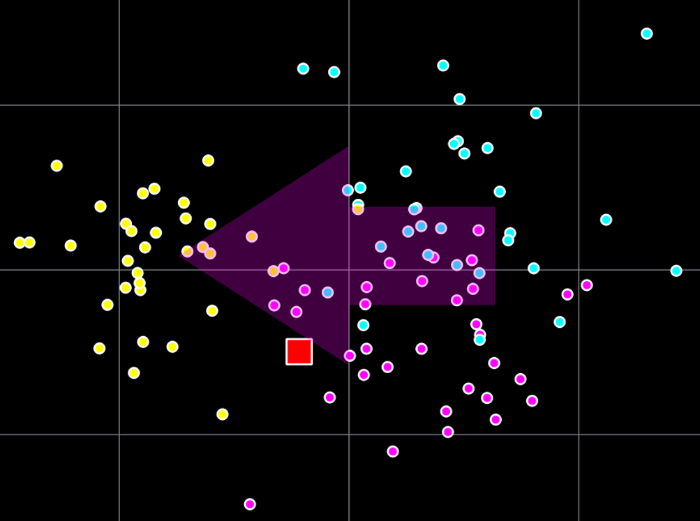

# Code for my diploma thesis
## Project and implementation of brain-computer interface applying brain activity patterns generated during motor imagery

### Main screen

### Calibration arrows

### Classification chart

